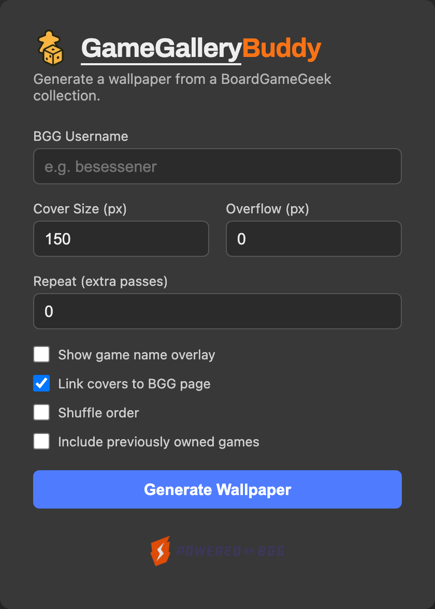

# GameGalleryBuddy

**GameGalleryBuddy** generates a wallpaper using all board games from a specified [BoardGameGeek](https://boardgamegeek.com) user’s collection.


## Getting Started

### Configuration

The app calls the BoardGameGeek XML API, which requires an API token.

1. Generate a token at [boardgamegeek.com/applications](https://boardgamegeek.com/applications).
2. Create a `.env` file in the project root with:

   ```env
   BGG_API_TOKEN=your-token-here
   ```

### Run

Run the application with:

```bash
./run.sh
```

Then, open your browser and go to:

```
http://localhost:8080/
```

## User Interface

The start page is a form for building the wallpaper: enter a BGG username, adjust the options below it, and submit to generate the wallpaper.



On the generated wallpaper page, hover the top-right corner to reveal a settings icon (⚙). It opens a panel with the same options, pre-filled with the current values — change them and hit **Apply** to regenerate in place, or **Home** to return to the start page.

## Parameters

The form and settings panel cover all of these; they're also usable directly as `/collection` query parameters.

| Parameter          | Required | Default | Description                                                                              |
| ------------------ | -------- | ------- | ---------------------------------------------------------------------------------------- |
| `username`         | ✅ Yes   | —       | BGG username of the collection owner.                                                    |
| `size`             | ❌ No    | `150`   | Size (in pixels) of each board game cover on the wallpaper.                              |
| `showName`         | ❌ No    | `false` | Whether to display the game name as an overlay on the image.                             |
| `showUrl`          | ❌ No    | `true`  | Whether to make game images clickable, linking to their BGG pages.                       |
| `shuffle`          | ❌ No    | `false` | Shuffle the games randomly (if `true`) or keep their original order.                     |
| `overflow`         | ❌ No    | `0`     | Allows images to overflow the container edges, in pixels.                                |
| `repeat`           | ❌ No    | `0`     | Repeats the image list `(repeat + 1)` times to extend the wallpaper.                     |
| `includePrevOwned` | ❌ No    | `false` | Also include games marked as _previously owned_ on BGG. Owned games are always included. |

## Example

Open the following URL in your browser to see an example:

```
http://localhost:8080/collection?username=besessener&size=85&showName=no&showUrl=no&shuffle=yes&overflow=20&repeat=1
```

## Sample Output


